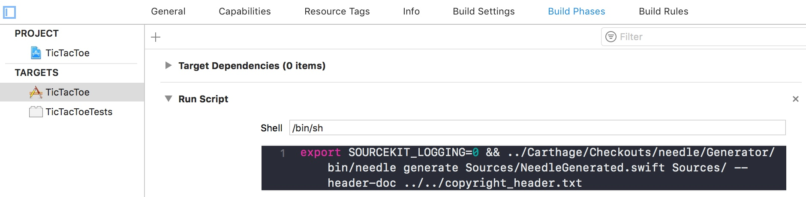

# Needle code generator

This document describes what the Needle code generator is and how it works at a high-level. More importantly, this document details how to use the generator and how to integrate it with a Xcode project to ensure compile-time safety of DI code.

## Overview

Needle code generator is a command-line utility that generates Swift source code by parsing developer-written Swift DI code. The generated code "wires up" the various `Component` subclasses developers write. From a DI graph structure perspective, the generator creates the edges between the individual `Component` nodes. The generated code is then compiled into the application thereby providing a complete DI graph.

## Compile-time safety

One of the biggest advantages of Needle, over other DI frameworks, is its compile-time safety guarantees. If a dependency required by a `Component` cannot be fulfilled by any of its reachable ancestor `Component`s, the generated Swift code will fail to compile. In this case Needle's generator returns an error describing the specific unsatisfied dependency. For example, `Could not find a provider for (scoreStream: MyScoreStream) which was required by ScoreSheetDependency, along the DI branch of RootComponent->LoggedInComponent->ScoreSheetComponent.`

When integrated with Xcode, as described below, Xcode build will fail in case a dependency cannot be fulfilled. This allows a quick feedback and iteration cycle when developing features. Without running the app, developers can debug where the DI graph might be incorrect. With this guarantee, developers can write and modify DI code with confidence. If the Xcode build succeeds, the changes to DI code are correct.

## High-level algorithm overview

From a very high-level, the generator runs in 5 stages. First, the generator parses all the source Swift files, written by developers, using SourceKit via [SourceKittenFramework](https://github.com/jpsim/SourceKitten). This allows the generator to produce an in-memory cache of all the `Component` nodes as well as their `Dependency` protocols that represent the vertices of the DI graph.

Second, the generator links together the parent-child relationships of all the `Component` nodes. It does this by looking at which `Component` instantiates which other `Component`.
```swift
class LoggedInComponent: Component<LoggedInDependency> {
    var gameComponent: GameComponent {
        return GameComponent(parent: self)
    }
}
```
Needle's generator parses the above Swift code and deduces that `LoggedInComponent` is the parent of `GameComponent`.

Third, for each `Component`'s dependency declared in its `Dependency` protocol, the generator traverses upwards, starting from the said `Component`, to visit all its ancestor `Component`s in search for the dependency object. A match is only found when both the property's variable name **and** its type are matched. Because the generator traverses upwards, the lowest level and therefore the closest match is always used, when viewed with the root of the DI graph at the top. This is the stage if a dependency cannot be fulfilled, the generator exists with an error described in the section above. As fulfillments are found, the generator stores the paths in memory to be used in the next stage.

During the fourth stage, the generator produces a `DependencyProvider` class that conforms to the `Dependency` protocol of a `Component`, to provide the dependencies via the paths found in the previous stage. These generated classes also provide a second-level of compile-time safety. If for whatever reason the previous stage incorrectly produced a path, the generated `DependencyProvider` class will not compile since its conformance to the `Dependency` protocol would have been invalid. For each produced `DependencyProvider`, a piece of provider registration code is also generated for the DI graph path that leads to the `Component` the provider provides for. This is where the method `registerProviderFactories` is from when we discussed Needle's [API](./API.md).

Finally at the fifth and last stage, all the generated `DependencyProvider` classes along with their registration code are serialized to a Swift file. This Swift file should be included in the Xcode project just like any other source file.

## Installation

The generator can be installed via either [Carthage](https://github.com/Carthage/Carthage) or [Homebrew](https://github.com/Homebrew/brew).

### Installation via [Carthage](https://github.com/Carthage/Carthage)

Please follow the standard [Carthage installation process](https://github.com/Carthage/Carthage#quick-start)
```
github "https://github.com/uber/needle.git" ~> VERSION_OF_NEEDLE
```
Once Carthage is done building, the generator binary is located at `Carthage/Checkouts/needle/Generator/bin/needle`.

### Installation via [Homebrew](https://github.com/Homebrew/brew)

```
brew install needle
```
Once installed the generator binary can be executed directly as `$ needle version`.

## Xcode integration

Even though Needle's generator can be invoked from the commandline, it is most convenient when it's directly integrated with the build system. At Uber we use [BUCK](https://buckbuild.com/) for CI builds and Xcode for local development. Therefore for us, Needle is integrated with BUCK. We then make Xcode invoke our BUCK Needle target for code generation. Since the vast marjority of Swift applications use Xcode as the build system, we'll cover this here.

1. Download the latest generator binary, either manually from the [Releases page](https://github.com/uber/needle/releases), or using [Carthage](https://github.com/Carthage/Carthage) or [Homebrew](https://github.com/Homebrew/brew).
2. Add a "Run Script" phase in the application's executable target's "Build Phases" section. 
3. Make sure the "Shell" value is `/bin/sh`.
4. Add a shell script that invokes the generator in the script box. For example, the sample TicTacToe app uses the script: `export SOURCEKIT_LOGGING=0 && ../Carthage/Checkouts/needle/Generator/bin/needle generate Sources/NeedleGenerated.swift Sources/ --header-doc ../../copyright_header.txt`.
    * If installed via Carthage, the binary can be invoked by pointing to the Carthage checkout relative to where the Xcode project file is. In our sample, this path is `../Carthage/Checkouts/needle/Generator/bin/needle generate`.
    * If installed via Homebrew, the binary can be executed by directly invoking `needle generate`

The first part of the script `export SOURCEKIT_LOGGING=0` silences the SourceKit logging, otherwise Xcode will display the logs as error messages. This is simply to reduce noise in Xcode. It isn't strictly required. The rest of the script invokes the generator executable, with a few arguments. If the generator is installed via Carthage, please keep in mind that the path to the generator executable binary is relative to the Xcode project's location. In our sample apps, the path is `../Carthage/Checkouts/needle/Generator/bin/needle`. This might be different depending on your project's folder structure. The first argument `generate` tells the executable to run the code generation command. The second argument `Sources/NeedleGenerated.swift` tells the generator to export the generated code to that location. The third argument `Sources/` tells the generator where all the application source code is for parsing. The last optional argument `--header-doc` instructs the generator to use the text in the specified file as the header doc for the exported file that contains the generated code. Please refer to the section below for all possible parameters.

That's it for the Xcode integration. Now every time Xcode builds the application, Needle's generator is run to generate and output the necessary DI code.

## Generator parameters

### Available commands

`generate`: Instructs the generator to parse Swift source files, generate DI code and export to the specified destination file.
`version` prints the version of the generator.

### `generate` command

#### Required positional parameters
1. Path to the destination file of generated Swift DI code. For example `Sources/NeedleGenerated.swift`, which is relative to the Xcode project's location.
2. Paths to the root folders of Swift source files, or text files containing paths of Swift source files with specified format. Any number of paths can be specified. All source list files must be of the same format. See below for more details on sources list file. For example, `Sources/ sources_list_file.txt`, instructs the generator to both recursively parse all Swift source files inside the "Sources" directory, as well as the source paths contained in the "sources_list_file.txt" file.

#### Sources list file

The generator can either parse all Swift files inside a directory including the ones in sub-directories, or if a file is specified, the generator assumes the file is a text file containing a list of Swift source file paths. The file is referred to as the sources list file. Two formats for this file are supported, `newline` and `minescaping`. With the `newline` format, the generator assumes each line in the sources list file is a single path to a Swift source file to be parsed. The `minescaping` format specifies that paths are escaped with single quotes if escaping is needed, while paths that don't require escaping are not wrapped with any quotes. All the paths are separated by a single space character. Use the `--sources-list-format` optional parameter to specify the format if necessary.

If multiple sources list files are given to the `generate` command, they all have to have the same format.

#### Optional parameters

`--sources-list-format`: The format of the Swift sources list file. If this parameter is not specified, all sources list file is assumed to use the `newline` format. Please see [Sources list file](#Sources-list-file) section above for details.

`--exclude-suffixes`: A list of file name suffixes to ignore for parsing. For example with `--exclude-suffixes Tests Mocks`, the generator will ignore any file whose name, excluding the file extension, ends with either "Test" or "Mocks".

`--exclude-paths`: A list of path strings to ignore for parsing. For example with `--exclude-paths /sample /tests`, the generator will ignore any file whose path contains either "/sample" or "/tests".

`--header-doc`: A path to a text file whose content is used as the header doc for the generated DI code file. In the TicTacToe samples included, we specify `--header-doc ../../copyright_header.txt` to add copyright header to the generated file.

`--additional-imports`: Any additional import statements to include in the generated DI code. Needle's generator automatically parses and includes all import statements in Swift source files that contain `Component` and `Dependency` constructs, in the
generated code. With certain module structure, such as the one used internally at Uber, the top-level module is never directly imported. Therefore using this parameter allows the generated file to correctly import the top-level module. For example, for the Rider app at Uber `import Rider` is specified.

`--pluginized`: If specified, the generator will parse and generate plugin-based DI graphs. This is generally not useful. Uber's plugin architecture uses this.

`--collect-parsing-info`: A boolean value indicating if information should be collected for parsing execution timeout errors. This defaults to `false`.

`--timeout`: The timeout value, in seconds, to use for waiting on parsing and generating tasks. This defaults to 30 seconds.

`--concurrency-limit`: The maximum number of tasks to execute concurrently. This defaults to the maximum concurrency allowed by the hardware.

## Integrate generated code

### Include generated file

In order to include the generated DI code in the application's binary, the generated file must be included in the Xcode project. At Uber with BUCK, we simply include Needle's generator target into the `srcs` parameter.
```swift
srcs = glob([
    "Sources/**/*.swift",
]) + [":Needle"],
```

For Xcode projects, a one-time setup needs to be done. Once the Needle generator command is run, either via commandline or via the Xcode build-phase integration detailed above, we can just drag and drop the generated file into the binary target. In the included TicTacToe samples, the `NeedleGenerated.swift` file is included in the binary `TicTacToe` target.

### Execute generated code

Needle's generated DI code provides a simple, single entry point for the application to use. The generated file exposes a single method `public registerProviderFactories` that the application should invoke as the first step upon launching. In typical iOS applications, this simply means invoking this method in the `AppDelegate`. For example, the included TicTacToe sample app invokes this as the following:
```swift
@UIApplicationMain
class AppDelegate: UIResponder, UIApplicationDelegate {

    func application(_ application: UIApplication, didFinishLaunchingWithOptions launchOptions: [UIApplicationLaunchOptionsKey: Any]?) -> Bool {
        registerProviderFactories()
        /// Other logic below.
        ...
    }
```

For more complex application structures, such as the one Uber uses, a separate `main.swift` file is used. In this case, the same applies. The first thing in the `main.swift` file, we invoke `registerProviderFactories()`.
